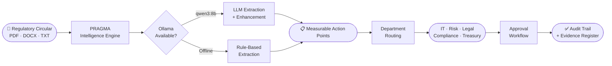
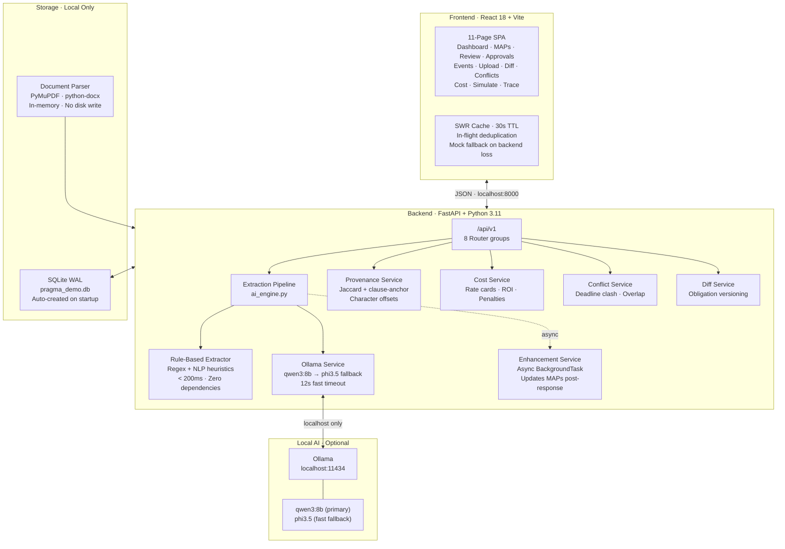

<div align="center">

# PRAGMA
### Proactive Regulatory Autonomous Governance & Management Agent

**An air-gapped compliance intelligence platform that turns regulatory circulars into routable, deadline-tracked action points — in under two seconds, with no internet connection.**

[](https://python.org)
[](https://fastapi.tiangolo.com)
[](https://react.dev)
[](https://sqlite.org)
[](https://ollama.com)
[](/)
[](/)

---

*Built for Indian banking institutions operating under RBI, SEBI, and MCA oversight*

</div>

---

## The Problem

Indian banks receive hundreds of regulatory circulars annually. Each circular contains multiple buried compliance obligations — specific deadlines, department assignments, and penalty thresholds buried in dense legalese.

Today, this is **a manual process**:

- Compliance officers read circulars by hand
- Obligations are extracted by judgment and routed via email
- Deadlines are tracked in spreadsheets
- Evidence is gathered retroactively before audits

**The cost of this failure mode is enormous.**

> RBI levied penalties exceeding **₹500 crore** on Indian banks in FY2023-24. Most were **process failures, not intent failures** — banks that knew about the obligation but missed the deadline, or assigned it to the wrong team.

PRAGMA eliminates the gap between *receiving* a regulatory circular and *acting on it*.

---

## What PRAGMA Does

Upload any RBI, SEBI, or MCA circular. In under two seconds, PRAGMA:

1. **Extracts every compliance obligation** as a discrete, actionable MAP (Measurable Action Point)
2. **Routes each MAP** to the correct department with priority and deadline
3. **Links every MAP to the exact clause** in the source document that triggered it
4. **Tracks the obligation** through approval → implementation → audit evidence
5. **Quantifies the financial stakes** — implementation cost, penalty exposure, and ROI

No internet. No API keys. No cloud. Every byte stays on the machine.



---

## Platform Features

### Intelligence Pipeline

| Feature | What It Does |
|---|---|
| **MAP Extraction** | Two-layer engine: deterministic rule-based extraction (zero dependencies, always available) + async Ollama LLM enhancement for higher accuracy on complex circulars |
| **Clause Provenance** | Every MAP is linked to the exact sentence that produced it using Jaccard similarity with clause-anchored scoring. Character-offset highlighting in the UI — no black box, full explainability |
| **Regulatory Diff Engine** | Side-by-side obligation comparison between two versions of a circular. Identifies added, removed, and modified obligations — critical for tracking regulatory evolution |
| **Cross-Regulator Conflict Matrix** | Detects overlapping obligations, deadline clashes, priority mismatches, and workload surges when RBI, SEBI, and MCA issue simultaneous directives to the same department |
| **Compliance Cost Intelligence** | Quantifies the financial burden per MAP and per department: implementation cost in ₹, effort in person-days, regulatory penalty exposure, and ROI of being compliant |
| **Impact Simulator** | Pre-ingestion predictive analysis — paste a circular draft, see the full compliance burden before formally registering the obligation |

### Workflow & Audit

| Feature | What It Does |
|---|---|
| **Approval Workflow** | Compliance officers approve or reject MAPs with notes. Full status lifecycle: `Pending → Approved → In Progress → Completed` with transition validation |
| **MAP Register** | Filterable, sortable register of all obligations across all circulars. Department, priority, deadline, and status filters. Overdue tracking with visual alerts |
| **AI Extraction Review** | Source circular on the left with highlighted evidence sentences. Extracted MAP on the right. Side-by-side human validation of every AI decision |
| **Audit Event Ledger** | Immutable, append-only log of every platform action: uploads, extractions, approvals, status changes — each timestamped with actor attribution |
| **Compliance Traceability Graph** | Interactive visual graph tracing the complete lifecycle: circular → clause → MAP → department → approval → completion. Built with React Flow |

### Offline & Enterprise

| Feature | What It Does |
|---|---|
| **Air-Gapped Architecture** | Zero runtime external dependencies. Works with WiFi disconnected and Ollama stopped. No request ever leaves the machine |
| **Local Document Ingestion** | PDF, DOCX, DOC, and TXT parsed locally via PyMuPDF and python-docx. No cloud OCR, no third-party parsing |
| **Graceful Degradation** | All 11 platform features remain operational when Ollama is unavailable. Rule-based extraction produces MAPs in under 200ms |
| **Demo Mode** | Single API call resets to a pristine, judge-ready state: 3 regulatory circulars, 14 MAPs, 2 approvals, and a 9-event audit trail |
| **Dark Mode** | Full dark/light mode with a professional design system: IBM Plex type family, custom brass/navy colour tokens, WCAG-compliant contrast |

---

## System Architecture



**Architectural guarantees:**
- No external network call is ever made at runtime
- Every feature degrades gracefully when the AI layer is unavailable
- The entire platform starts from a fresh clone with a single command

---

## Quick Start

### Prerequisites

| Requirement | Version | Required |
|---|---|---|
| Python | 3.11+ | ✅ Yes |
| Node.js | 18+ | ✅ Yes |
| Ollama | Latest | ⚡ Optional — for LLM-enhanced extraction |

### 1. Clone

```bash
git clone https://github.com/AnoushkaNag/PRAGMA.git
cd PRAGMA
```

### 2. Backend

```bash
cd backend
python -m venv venv
source venv/bin/activate          # Windows: .\venv\Scripts\activate
pip install -r requirements.txt
uvicorn app.main:app --reload --port 8000
```

The backend **auto-creates the SQLite database and seeds departments** on first startup. No migration commands needed.

- API: `http://localhost:8000`
- Interactive docs: `http://localhost:8000/docs`

### 3. Frontend

```bash
cd frontend
npm install
npm run dev
```

Frontend: `http://localhost:3000`

### 4. Load demo data

```bash
curl -X POST http://localhost:8000/api/v1/demo/reset
```

Seeds **3 realistic regulatory scenarios** with 14 MAPs, 2 approved obligations, and a full audit trail — ready for demonstration immediately.

### 5. (Optional) Enable AI extraction

```bash
# Install Ollama: https://ollama.com
ollama pull phi3.5     # 2.2 GB — runs on 4 GB RAM
ollama pull qwen3:8b   # 4.7 GB — higher quality, requires 8 GB RAM
ollama serve
```

PRAGMA auto-discovers the best available model. If Ollama isn't running, rule-based extraction activates silently — no configuration change needed.

---

## Environment Configuration

All defaults work out of the box. To customise:

```bash
cp backend/.env.example backend/.env
```

```env
# AI Engine
AI_ENGINE=ollama              # "ollama" | "rule_based"
OLLAMA_MODEL=qwen3:8b         # Primary model
OLLAMA_FALLBACK_MODEL=phi3.5  # Fast fallback on primary timeout

# Database
DATABASE_URL=sqlite:///./pragma_demo.db

# Optional: additional CORS origins (Railway / Render deployment)
# CORS_ORIGINS=https://pragma.yourdomain.com
```

---

## 5-Minute Demo Playbook

| # | Step | Duration | What to show |
|---|---|---|---|
| 1 | **Seed + Dashboard** | 30s | Run `/demo/reset`. Open dashboard. KPI strip: circulars, critical MAPs, overdue, compliance score. Compliance Investment widget: total ₹ cost vs. ₹ penalty exposure |
| 2 | **Live Upload** | 60s | Upload a real RBI circular PDF. Watch MAPs appear in under 2 seconds: action, department, priority, deadline, confidence score — all extracted automatically |
| 3 | **Explainability** | 60s | Open AI Extraction Review. Click any MAP. The exact sentence in the source circular highlights in yellow. Show a judge: *"This is the clause that produced this obligation"* |
| 4 | **Approval Workflow** | 30s | Open Approvals. Approve a Critical MAP. Watch the status transition and the audit event log update in real time |
| 5 | **Intelligence Features** | 90s | Conflict Matrix: RBI + SEBI deadline clash on IT in same 14-day window. Cost Intelligence: per-department ₹ breakdown + ROI. Diff Engine: compare two circular versions |
| 6 | **Offline Proof** | 30s | Disconnect WiFi. Stop Ollama. Reload browser. Upload a new circular. Every feature continues. MAPs extracted in under 200ms |

---

## Tech Stack

| Layer | Technology | Why |
|---|---|---|
| **Frontend** | React 18, Vite, Tailwind CSS | Lazy-loaded 11-page SPA, ~180KB initial bundle |
| **Charts** | Recharts | Compliance pipeline, status donut, department heatmap |
| **Graph** | @xyflow/react | Traceability graph with pan/zoom |
| **Backend** | FastAPI, Python 3.11 | Async endpoints, background LLM enhancement |
| **Database** | SQLite (WAL journaling) | Auto-created on startup, zero configuration |
| **ORM** | SQLAlchemy 2.0 | Type-safe models, UUID columns across SQLite + Postgres |
| **AI (optional)** | Ollama — qwen3:8b / phi3.5 | Local inference, 12s fast timeout with fallback |
| **AI (fallback)** | Regex + NLP heuristics | Always available, zero latency, zero dependencies |
| **Document parsing** | PyMuPDF + python-docx | Local PDF/DOCX extraction — no cloud OCR |
| **Migrations** | Alembic | Schema history with provenance field additions |

---

## Reliability Guarantees

| Guarantee | Implementation |
|---|---|
| Backend unreachable | All data hooks fall back to representative mock data. A banner is shown — not an error screen |
| Ollama unavailable | `ai_engine.py` never raises. Rule-based extraction runs automatically |
| LLM timeout | 12s fast timeout on primary model, automatic switch to `phi3.5` for that request |
| Frontend crash | `ErrorBoundary` wraps the entire app — component crashes show a recovery screen |
| Slow backend startup | `useBackendStatus` waits 12 seconds before marking offline — eliminates false-offline flash |
| Duplicate API calls | `fetchOnce()` deduplicates in-flight requests — Dashboard + MAPsView mounting simultaneously share one request |
| Stale UI after actions | Cache busting via `bustPrefix()` forces fresh fetch after upload, approve, or status change |

---

## Project Structure

```
PRAGMA/
├── backend/
│   ├── app/
│   │   ├── api/v1/endpoints/
│   │   │   ├── circulars.py       # Upload · parse · rule-based extract · async LLM enhance
│   │   │   ├── maps.py            # MAP register · status transitions
│   │   │   ├── approvals.py       # Compliance review · audit events
│   │   │   ├── events.py          # Immutable audit ledger
│   │   │   ├── insights.py        # Diff · Conflicts · Cost · Provenance
│   │   │   ├── simulate.py        # Pre-ingestion impact prediction
│   │   │   └── demo.py            # Demo reset · status check
│   │   ├── services/
│   │   │   ├── ai_engine.py       # Extraction router — Ollama → rule-based fallback
│   │   │   ├── rule_extractor.py  # Deterministic MAP extraction — zero dependencies
│   │   │   ├── ollama_service.py  # Local LLM — auto model discovery, prompt cache
│   │   │   ├── enhancement_service.py  # Async background LLM enhancement
│   │   │   ├── provenance_service.py   # Clause-to-MAP evidence with character offsets
│   │   │   ├── cost_service.py    # ₹ burden quantification · ROI · penalty exposure
│   │   │   ├── conflict_service.py     # Cross-regulator conflict detection
│   │   │   ├── diff_service.py    # Obligation version comparison
│   │   │   └── document_parser.py # Local PDF/DOCX text extraction
│   │   ├── models/                # SQLAlchemy ORM — Circular · MAP · Approval · Event
│   │   ├── schemas/               # Pydantic request/response contracts
│   │   ├── config.py              # pydantic-settings — all config from .env
│   │   ├── database.py            # SQLAlchemy engine · session · WAL · UUIDType
│   │   └── main.py                # App factory · CORS · lifespan startup
│   ├── alembic/versions/          # Schema migration history
│   ├── tests/                     # Backend test suite
│   └── requirements.txt
│
├── frontend/src/
│   ├── pages/                     # 11 route-level pages
│   ├── components/shared/         # Reusable UI — badges, skeletons, drawers, charts
│   ├── hooks/                     # useMaps · useCirculars · useEvents · useBackendStatus
│   ├── api/                       # Typed backend call functions
│   ├── services/                  # Axios instance · SWR-style dataCache
│   └── utils/                     # Formatters · constants · mockData
│
├── railway.json                   # Railway deployment config
└── nixpacks.toml                  # Build config for Railway/Render
```

---

## Compliance Coverage

| Regulator | Validated Circular Types |
|---|---|
| **RBI** | Digital Lending Guidelines, KYC/AML Master Direction, IT Risk, Cybersecurity Framework, Liquidity Management |
| **SEBI** | Cyber Resilience Framework (CSCRF), Mutual Fund Regulations, Investor Protection |
| **MCA** | Corporate Governance, Financial Reporting Obligations |
| **FEMA** | Cross-border transaction reporting, FCRA compliance |

---

## Team

| Name | Role |
|---|---|
| **Anoushka Nag** | Architecture lead · air-gapped migration · cost intelligence · provenance engine · enterprise hardening |
| **Ashwin Yadav** | Frontend scaffold · backend integration · design system · dark mode |
| **Anuja Chakraborty** | Data pipeline · test suite · SQLAlchemy compatibility |
| **Diyasha Nag** | Backend APIs · approval workflow · status transitions |
| **Diptanshu Vishwa** | Database layer · schema design |

See [CONTRIBUTORS.md](CONTRIBUTORS.md) for per-commit attribution.

---

## Documentation

| Document | Description |
|---|---|
| [Architecture](docs/architecture.md) | System design, component responsibilities, data flow |
| [Demo Script](docs/demo-script.md) | Detailed 5-minute runbook with judge talking points |
| [Contributors](CONTRIBUTORS.md) | Full per-person attribution by feature |

---

<div align="center">

**PRAGMA** · Air-Gapped Compliance Intelligence · v1.0.0

*Built in 30 days. Runs on your laptop. Works with no internet.*

`FastAPI` · `React` · `SQLite` · `Ollama` · `Offline-First`

</div>
